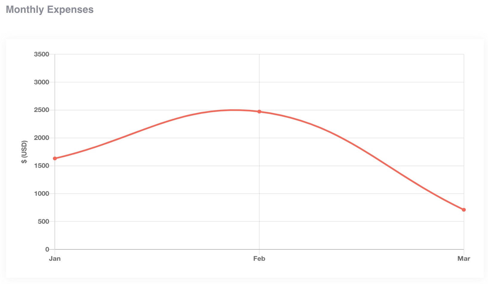
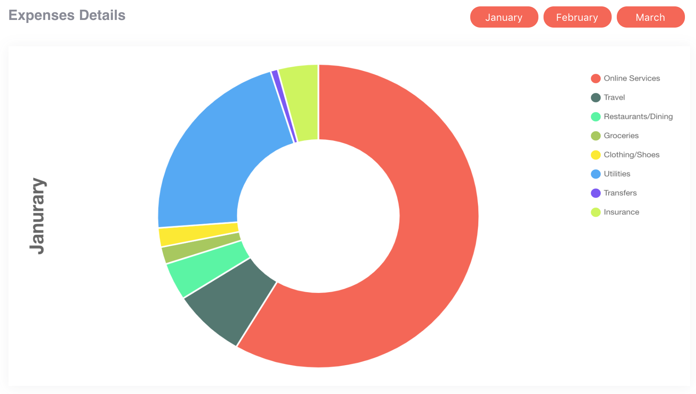
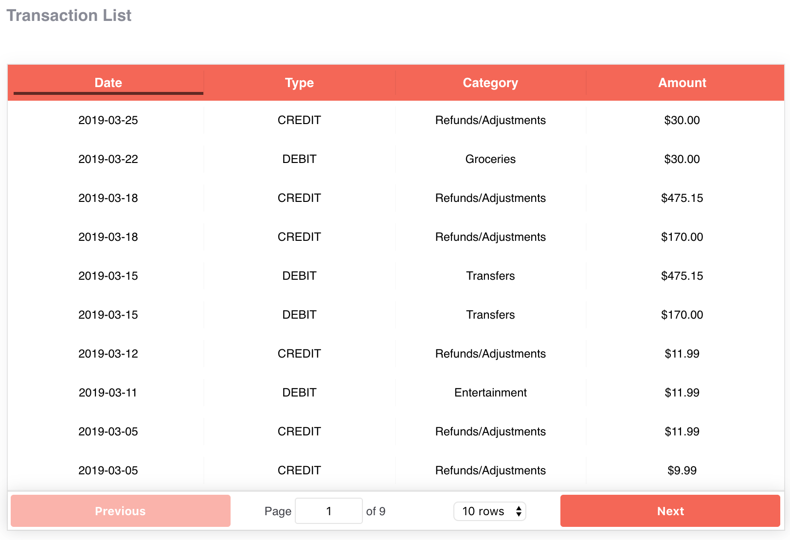

 

## Betterfin
This is a single page responsive app that gives the user a snapshot of their expenses. The user will be able to quickly understand the data by glancing at a monthly expense overview, month by month expense breakdown, and individual transaction chart.

You can visit the app [here](https://betterfin-davidyoon.herokuapp.com/)!

### Technologies Used
React, JavaScript, HTML5, and CSS3.

### Monthly Expense Overview

Created using Chart.js

User will be able to track total monthly expenses. Hoving over the month's data point on the graph, will display specific dollar amounts.

### Monthly Expense Breakdown

Created using Chart.js

User can view a month's expenses, breakdown into percentages for each category. Hoving over the category's section on the graph, will display specific dollar amounts.

### Transaction Chart

Created using React Table

User can view all transactions made and can also sort through them by date, type, category, or amount.

