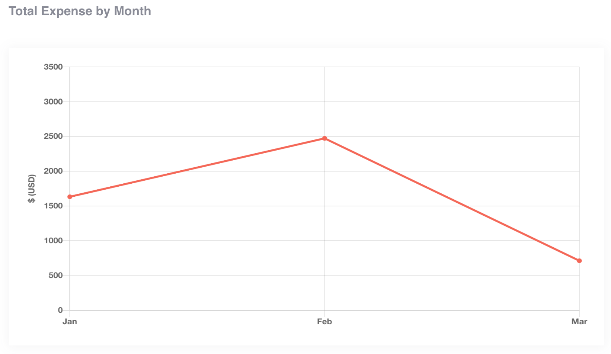

## Betterfin
Single page app that gives the user a snapshot of their expenses through a monthly expense overview, month by month expense breakdown, and individual transaction chart.

You can visit the app [here](https://betterfin-davidyoon.herokuapp.com/)!

### Technologies Used
React, JavaScript, HTML5, and CSS3.

### Monthly Expense Overview

### Monthly Expense Breakdown

### Transaction Chart

